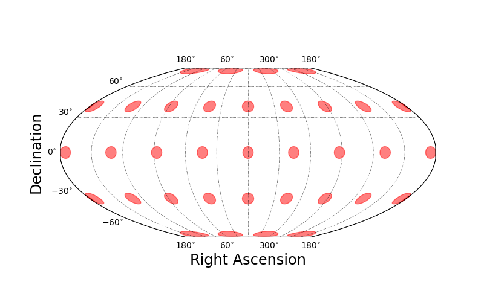
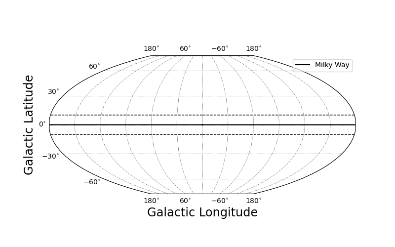

.. _basic-interface:
.. role:: python(code)
   :language: python

Basic SkyProj Interface
=======================

Getting Started
---------------

`SkyProj` is an interface linking `matplotlib <https://matplotlib.org/>`_ with `PROJ <https://proj.org/>`_ to create good looking and interactive visualizations of astronomical map data, in particular `HealSparse <https://healsparse.readthedocs.io/en/latest/>`_ and `HEALPix <https://healpix.jpl.nasa.gov/>`_ maps.
It has its origins in `cartosky <https://github.com/kadrlica/cartosky>`_, which was built on `cartopy <https://scitools.org.uk/cartopy/docs/latest/>`_ and some of the features may be familiar to users of `cartopy`.
However, it has diverged significantly as the needs of mapping the sky are somewhat different from mapping the Earth.

The fundamental base class for `SkyProj` is the :code:`skyproj.Skyproj()` sky projection.
This class is a container for a matplotlib axis (for plotting); a matplotlib axis artist (for drawing gridlines and labels); a coordinate reference system (CRS) which describes a particular map projection; and a large number of methods for plotting maps, lines, polygons, and colorbars.
The :code:`Skyproj()` class is designed to create projections that are accurate and attractive for full-sky and zoomed maps.

Creating a Default :code:`Skyproj()`
------------------------------------

The default projection for a :code:`skyproj.Skyproj()` is the `Plate carrée <https://en.wikipedia.org/wiki/Equirectangular_projection>`_ (literally "flat square") or equirectangular projection.
This projection maps longitude (right ascension) and latitude (declination) directly onto a grid.
It is neither conformal (angle preserving) or equal area, so is not particularly recommended for plotting astronomical data.

.. code-block :: python

    import matplotlib.pyplot as plt
    import skyproj

    # Create a figure and an associated axis.
    fig, ax = plt.subplots(figsize=(8, 5))
    # We can specify the axis in the instantiation of Skyproj(), or can
    # let it use the "current axis".
    sp = skyproj.Skyproj(ax=ax)
    # Draw Tissot's Indicatrices to show the distortion of the projection.
    sp.tissot_indicatrices()
    plt.show()

.. image:: images/Skyproj_with_indicatrices.png
   :width: 600
   :alt: Default cylindrical Skyproj with Tissot's indicatrices.

Creating an Equal-Area :code:`McBrydeSkyproj()`
-----------------------------------------------

The `McBryde-Thomas Flat Polar Quartic projection <https://proj.org/operations/projections/mbtfpq.html>`_ is an equal-area pseudocylindrical projection that has been used for the Dark Energy Survey.

The McBryde projection can be accessed with :code:`skyproj.McBrydeSkyproj()` class.

.. code-block :: python

    import matplotlib.pyplot as plt
    import skyproj

    fig, ax = plt.subplots(figsize=(8, 5))
    sp = skyproj.McBrydeSkyproj(ax=ax)
    sp.tissot_indicatrices()
    plt.show()

For further information on other projections available, see :ref:`projections`.

Drawing Lines and Polygons
--------------------------

It is easy to draw lines, polygons, and circles on a :code:`Skyproj()` object.
When specifying connected points or polygon edges, they will be connected with a geodesic interpolation.
Similarly, circles are drawn as a connected locus of points that are all equidistant from the center as computed from geodesics.

.. code-block :: python

    import matplotlib.pyplot as plt
    import skyproj

    fig, ax = plt.subplots(figsize=(8, 5))
    sp = skyproj.McBrydeSkyproj(ax=ax)

    # Draw two geodesics, one of which will wrap around.
    sp.ax.plot([-10., 45.], [-10., 45.], 'r-', label='One')
    sp.ax.plot([170., 210.], [-10., 45.], 'b--', label='Two')

    # Draw two unfilled polygons, one of which will wrap around.
    sp.draw_polygon([-20, 20, 20, -20], [20, 20, 40, 40],
                    edgecolor='magenta', label='Three')
    sp.draw_polygon([160, 200, 200, 160], [20, 20, 40, 40],
                    edgecolor='black', label='Four')

    # Draw two filled polygons, one of which will wrap around.
    sp.draw_polygon([-20, 20, 20, -20], [-20, -20, -40, -40],
                    edgecolor='black', facecolor='red', linestyle='--', label='Five')
    sp.draw_polygon([160, 200, 200, 160], [-20, -20, -40, -40],
                    edgecolor='red', facecolor='black', linestyle='-', label='Six')

    # Draw a circle
    sp.ax.circle(40.0, -40.0, 5.0, label='Seven')
    sp.ax.circle(-40.0, -40.0, 5.0, color='orange', label='Eight', fill=True)

    # Draw one open ellipse and one rotated, filled ellipse.
    # ellipse expects (ra, dec, r_A, r_B, theta)  [degrees]
    # where r_A=Semi-major axis, r_B=semi-minor axis, theta=position angle.
    sp.ax.ellipse(60, 15, 10, 4, 0, color='green', label='Nine')
    sp.ax.ellipse(300, 15, 15, 2, 45, fill=True, color='red', label='Ten')

    # Make a legend
    sp.ax.legend()
    plt.show()

Drawing the Milky Way
---------------------

Included in `SkyProj` is a convenient way of representing the Milky Way Galaxy.
The default is to plot a thick line along the Galactic equator, and two dashed lines at +/- 10 degrees.

.. code-block :: python

    import matplotlib.pyplot as plt
    import skyproj

    fig, ax = plt.subplots(figsize=(8, 5))
    sp = skyproj.McBrydeSkyproj(ax=ax)
    sp.draw_milky_way(label='Milky Way')
    sp.ax.legend(loc="upper right")
    plt.show()

It is also possible to specify that the default plotting units should be Galactic coordinates rather than Equatorial coordinates.
When using :code:`draw_milky_way()`, it will plot in Galactic coordinates.

.. code-block :: python

    import matplotlib.pyplot as plt
    import skyproj

    fig, ax = plt.subplots(figsize=(8, 5))
    sp = skyproj.McBrydeSkyproj(ax=ax, galactic=True, longitude_ticks='symmetric')
    sp.draw_milky_way(label='Milky Way')
    sp.ax.legend(loc="upper right")
    plt.show()

Survey Maps
-----------

`SkyProj` includes convenient survey classes which have the ability to plot survey outlines.
In addition, these survey classes have convenient preset projections and extents set that are appropriate for plotting the survey.
See :ref:`surveys` for further information on what surveys are available (and feel free to file an issue or make a PR for your favorite survey).

.. code-block :: python

    import matplotlib.pyplot as plt
    import skyproj

    fig, ax = plt.subplots(figsize=(8, 5))
    sp = skyproj.DESSkyproj(ax=ax)
    sp.draw_des(label='DES')
    sp.ax.legend()
    plt.show()

Plotting HealSparse and HEALPix Maps
------------------------------------

Plotting `HealSparse` maps can be performed with the :code:`draw_hspmap()` method on a :code:`Skyproj()` subclass.
The default setting for drawing a map is to automatically zoom in on the ra/dec range of the map to be plotted.
For speed and efficiency, map plotting in `SkyProj` is performed by first rasterizing the input map at a resolution appropriate for the given plot.
For more details on plotting :code:`HealSparse` and :code:`HEALPix` maps, see :ref:`maps`.

.. code-block :: python

    import matplotlib.pyplot as plt
    import numpy as np
    import healsparse as hsp
    import skyproj

    # Make a square noise field.
    hspmap = hsp.HealSparseMap.make_empty(32, 4096, np.float32)
    poly = hsp.geom.Polygon(ra=[0.0, 10.0, 10.0, 0.0], dec=[0.0, 0.0, 10.0, 10.0], value=1.0)
    pixels = poly.get_pixels(nside=hspmap.nside_sparse)
    hspmap[pixels] = np.random.normal(size=pixels.size).astype(np.float32)
    # Add in a central square of fixed value.
    poly2 = hsp.geom.Polygon(ra=[5, 5.2, 5.2, 5.0], dec=[5, 5.0, 5.2, 5.2], value=3.0)
    pixels2 = poly2.get_pixels(nside=hspmap.nside_sparse)
    hspmap[pixels2] = 3.0

    fig, ax = plt.subplots(figsize=(8, 5))
    sp = skyproj.McBrydeSkyproj(ax=ax)
    im, lon_raster, lat_raster, values_raster = sp.draw_hspmap(hspmap)
    sp.draw_inset_colorbar()
    plt.show()

Interactivity
-------------

All maps created by `SkyProj` are interactive using the standard `matplotlib <https://matplotlib.org/>`_ interactivity tools.
Zooming and panning are supported through the standard widgets.
When the map is zoomed, any :code:`healsparse` or :code:`HEALPix` map will be re-rasterized at the new resolution.
In this way, one can view a high resolution map over the full sky without rendering every tiny pixel; when zoomed, more detail will appear.

The default behavior on zoom is for the colorbar to be rescaled based on the range of map pixels shown in the current frame.
This functionality can be turned off by either instantiating the :code:`SkyProj()` subclass with :code:`autrescale=False` or by using :code:`sp.set_autorescale(False)`.

In addition, the default behavior on zoom is for the map to retain the original projection.
When zooming in to a small region far from the central longitude this can lead to large distortion (as seen in the Tissot Indicatrices of the McBryde projection above).
There is currently experimental support for reprojecting on the current displayed central longitude by hitting :code:`R` (for Reproject) when the mouse is within the plot window.
Performing the reprojection may be slow, and there are some cases where it can go awry.
When the zoom is below 1 degree across the reprojection will use a Gnomonic (tangent-plane) projection which has sufficiently small distortion at all locations.

Plotting Customization
----------------------

Much of the plotting functionality is decided by `SkyProj` itself.
However, there is a lot of customization available.
With `SkyProj` version 2 the customization is easier than ever.

Most fonts, font sizes, tick label sizes, etc, are set with the usual :code:`matplotlib` interface.
For example, you can set the tick label sizes and colors with :code:`sp.ax.tick_params(axis="x", labelsize=20, labelcolor="green")`.
The axis label sizes and colors can be set with :code:`sp.ax.set_xlabel("New X Label", fontsize=10, fontcolor="red")`.

Additional plot parameters are controlled via the :code:`matplotlib` RC parameter dictionary.
In particular:

* :code:`axes.linewidth`: Sets the width of the boundary of the full plot.

To override values, we recommend using a matplotlib RC context, like the following.
Note that the internal use of the `rc_params` (from `SkyProj` version 1) has been deprecated and is no longer used.

.. code-block :: python

    import matplotlib.pyplot as plt
    import skyproj

    # These values are comically exaggerated for effect.
    rcparams = {'axes.linewidth': 5}

    with plt.rc_context(rcparams):
        fig, ax = plt.subplots(figsize=(8, 5))
        sp = skyproj.McBrydeSkyproj(ax=ax)

    sp.ax.tick_params(axis="x", labelsize=20, labelcolor="green")
    sp.ax.tick_params(axis="y", labelsize=4, labelcolor="blue")
    sp.ax.set_xlabel("New X Label", fontsize=10, color="red")

    plt.show()

There are additional `SkyProj` specific customization options that are not controlled via the :code:`matplotlib` RC parameter dictionary.
These include the number of grid lines in the longitude and latitude direction, as well as minimum spacing between latitude tick labels to help prevent label clashes.
These options are controlled at initialization time via keyword parameters, and include:

* :code:`longitude_ticks`: Label longitude ticks from 0 to 360 degrees (``positive``) or from -180 to 180 degrees (``symmetric``).
* :code:`n_grid_lon`: The number of grid lines to use in the longitude direction (x in rectangular-style projections).
  The default is the axis ratio of the plot multiplied by the number of latitude grid lines.
* :code:`n_grid_lat`: The number of grid lines to use in the latitude direction (y in rectangular-style projections).
  The default is 6 lines.
* :code:`min_lon_ticklabel_delta`: The minimum relative spacing between longitude tick labels (relative to the width of the axis).
  Smaller values yield closer tick labels (and the potential for clashes), and larger valus yield more spacing between tick labels.

Supporting Additional Matplotlib Methods
----------------------------------------

For convenience, many :code:`matplotlib.Axes` plotting features are supported directly by `SkyProj`.
However, there may be additional methods that a user may wish to use in projected coordinates.
Usually this simply involves setting the keyword :code:`transform=sp.ax.projection`.

For example, one can use the :code:`arrow` method in the following way.
Note that use of :code:`arrow` is `discouraged https://matplotlib.org/stable/api/_as_gen/matplotlib.pyplot.arrow.html#matplotlib-pyplot-arrow`, and :code:`annotate` should be used instead.

.. code-block :: python

    import matplotlib.pyplot as plt
    import skyproj

    fig, ax = plt.subplots(figsize=(8, 5))
    sp = skyproj.McBrydeSkyproj(ax=ax)
    sp.ax.arrow(0, 0, 10, 10, width=1.0, transform=sp.ax.projection)
    plt.show()
