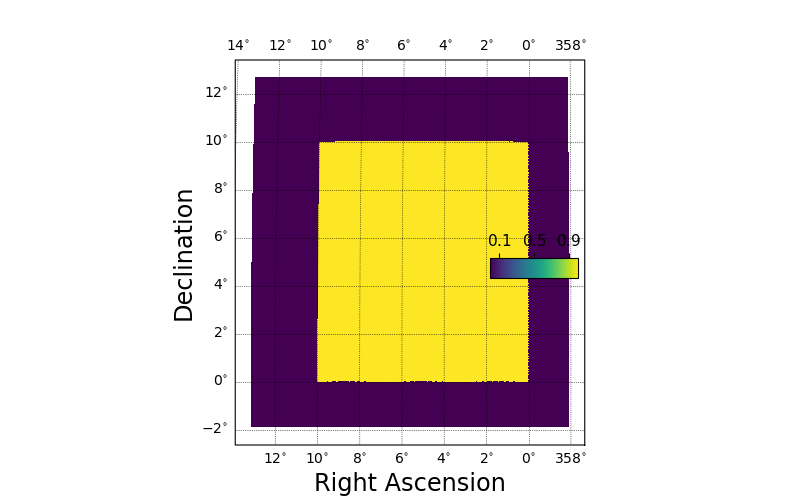
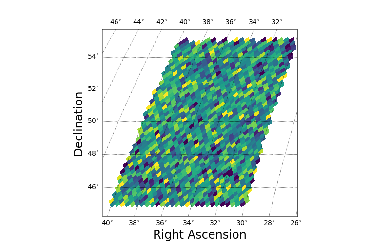
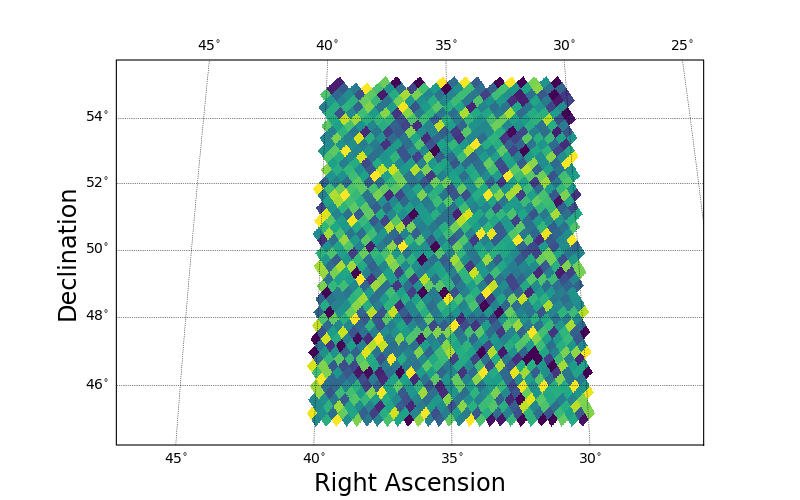

.. _maps:
.. role:: python(code)
   :language: python

SkyProj HealSparse and Healpix Mapping
======================================

The primary goal of `SkyProj` is to display `HealSparse` and `HEALPix` maps.
For speed and efficiency, map plotting in `SkyProj` is performed by first rasterizing the input map at a resolution appropriate for the given plot.
In this way, complicated and expensive calculations of individual healpix pixel boundaries can be avoided, leading to good performance even for very high resolution maps plotted over the full sky.

HealSparse Map Plots
--------------------

Plotting `HealSparse` maps can be performed with the :code:`draw_hspmap()` method on a :code:`skyproj.Skyproj()` subclass.
The default setting for drawing a map is to automatically zoom in on the ra/dec range of the map to be plotted.
The `valid_mask=True` option will plot the valid pixels (instead of the values in the pixels) in a map.

.. code-block :: python

    import matplotlib.pyplot as plt
    import numpy as np
    import healsparse as hsp
    import skyproj

    # Make a square noise field.
    hspmap = hsp.HealSparseMap.make_empty(32, 4096, np.float32)
    poly = hsp.geom.Polygon(ra=[0.0, 10.0, 10.0, 0.0], dec=[0.0, 0.0, 10.0, 10.0], value=1.0)
    pixels = poly.get_pixels(nside=hspmap.nside_sparse)
    hspmap[pixels] = np.random.normal(size=pixels.size).astype(np.float32)
    # Add in a central square of fixed value.
    poly2 = hsp.geom.Polygon(ra=[5, 5.2, 5.2, 5.0], dec=[5, 5.0, 5.2, 5.2], value=3.0)
    pixels2 = poly2.get_pixels(nside=hspmap.nside_sparse)
    hspmap[pixels2] = 3.0

    fig, ax = plt.subplots(figsize=(8, 5))
    sp = skyproj.McBrydeSkyproj(ax=ax)
    im, lon_raster, lat_raster, values_raster = sp.draw_hspmap(hspmap)
    sp.draw_inset_colorbar()
    plt.show()

.. image:: images/healsparse_one.png
   :width: 600
   :alt: HealSparse map with inset colorbar.

.. code-block :: python

    fig, ax = plt.subplots(figsize=(8, 5))
    sp = skyproj.McBrydeSkyproj(ax=ax)
    im, lon_raster, lat_raster, values_raster = sp.draw_hspmap(hspmap, valid_mask=True)
    sp.draw_inset_colorbar()
    plt.show()

If plotting in an interactive session, one can now zoom into the map with the matplotlib zoom tool.
Alternatively, one can specify the longitude and latitude range when drawing the map.
In the following example, we also use a different colormap and draw an external colorbar.
Note that at this zoom level the individual shapes of the HEALPix pixels are visible.

.. code-block :: python

    fig, ax = plt.subplots(figsize=(8, 5))
    sp = skyproj.McBrydeSkyproj(ax=ax)
    sp.draw_hspmap(hspmap, lon_range=[4.9, 5.3], lat_range=[4.9, 5.3], cmap=plt.colormaps['rainbow'])
    sp.draw_colorbar()
    plt.show()

HEALPix Map Plots
-----------------

Plotting `HEALPix` maps can be performed with the :code:`draw_hpxmap()` method on a :code:`skyproj.Skyproj()` subclass.
This code is very similar to that of of :code:`draw_hspmap()` above, although it does require the full map to be in memory (which is the primary advantage of `HealSparse` maps).
The default setting for drawing a map is to automatically zoom in on the ra/dec range of the map to be plotted.
The plotting and interactivity options are the same as for :code:`draw_hspmap()`.

.. code-block :: python

    hpxmap = hspmap.generate_healpix_map()

    fig, ax = plt.subplots(figsize=(8, 5))
    sp = skyproj.McBrydeSkyproj(ax=ax)
    sp.draw_hpxmap(hpxmap, nest=True)
    sp.draw_inset_colorbar()
    plt.show()

.. image:: images/healsparse_one.png
   :width: 600
   :alt: HEALPix map with inset colorbar.

HEALPix Pixel Plots
-------------------
Given a list of HEALPix pixel numbers and values, the :code:`draw_hpxpx()` method is available.
The map output is very similar to the code above.
However, this code does pixel value lookups behind the scenes to conserve memory.
In some cases it may be faster to use the pixels to build a `HealSparse` map and then use the :code:`draw_hspmap()` method instead.
The plotting and interactivity options are the same as for :code:`draw_hspmap()`.

.. code-block :: python

    pixels = hspmap.valid_pixels
    values = hspmap[pixels]

    fig, ax = plt.subplots(figsize=(8, 5))
    sp = skyproj.McBrydeSkyproj(ax=ax)
    # Note that you have to specify the nside when using draw_hpxpix.
    sp.draw_hpxpix(4096, pixels, values, nest=True)
    sp.draw_inset_colorbar()
    plt.show()

.. image:: images/healsparse_one.png
   :width: 600
   :alt: HEALPix pixel/value map with inset colorbar.

HEALPix Binned Plots
--------------------
Given a list of positions and values, one can use :code:`draw_hpxbin()` to bin the values and make a map.
This is analagous to :code:`matplotlib.pyplot.hexbin`, with the additional assurance that each pixel has the same area.

.. code-block :: python

    np.random.seed(1234)
    ra = np.random.uniform(low=30.0, high=40.0, size=10000)
    dec = np.random.uniform(low=45.0, high=55.0, size=10000)
    C = np.random.uniform(low=0.0, high=10.0, size=10000)

    fig, ax = plt.subplots(figsize=(8, 5))
    sp = skyproj.McBrydeSkyproj(ax=ax)
    # Default nside is 256.
    sp.draw_hpxbin(ra, dec, C=C)
    plt.show()

The default projection shown here has a central longitude of 0.0, which is not ideal for the Right Ascension range in this figure.
If one is running in an interactive matplotlib window, typing :code:`R` in the window will reproject at the center of the plotted data.

