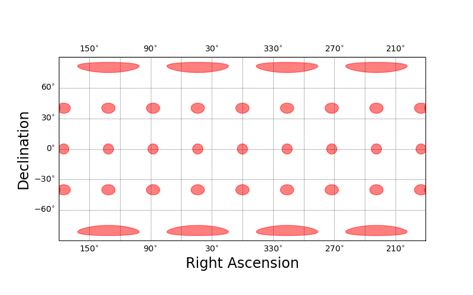
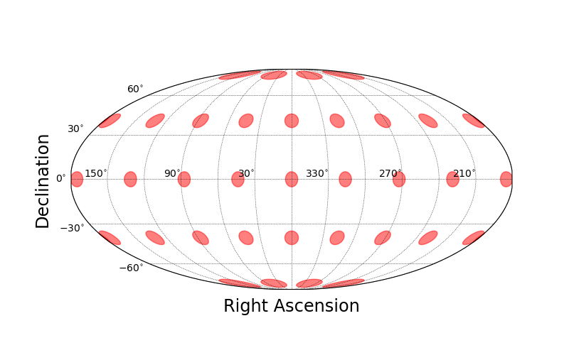
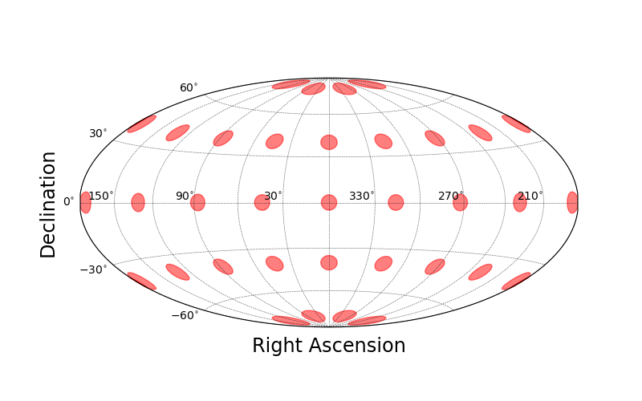

.. _projections:
.. role:: python(code)
   :language: python

SkyProj Projections
===================

`SkyProj` supports a wide variety of map projections, primarily equal-area.

The fundamental base projection class is the :code:`skyproj.Skyproj()` sky projection.
This class is a container for a number of elements.
In particular, it contains:

* A coordinate reference system (CRS) (a subclass of :code:`skyproj.SkyCRS()`) which describes a given PROJ projection.
  The :code:`skyproj.SkyCRS()` conforms to the matplotlib :code:`projection` interface.
* A matplotlib axis (:code:`skyproj.SkyAxes()`) to handle general plotting.
* A matplotlib axis artist (:code:`mpl_toolkits.axisartist.Axes()`) for drawing gridlines and labels.
* A large number of methods for drawing maps, lines, polygons, and colorbars.

When initializing any :code:`skyproj.Skyproj()` object, there are a number of parameters that can be set.
The most common options that a user would want to specify are:

* :code:`ax`: The specific axis object to replace with the skyproj axis.  If not specified, it will use the current axis as determined by matplotlib.
* :code:`lon_0`: The central longitude of the projection.
  For most pseudocylindrical projections, the distortion will be smallest near the central longitude.
* :code:`lat_0`: The central latitude of the projection.
  Only :code:`skyproj.LaeaSkyproj()` and :code:`skyproj.GnomonicSkyproj()` support :code:`lat_0`.
* :code:`extent`: Default extent of the map, specified as :code:`[lon_min, lon_max, lat_min, lat_max]`.
  This may be overridden if a map is plotted with :code:`zoom=True`.
* :code:`autorescale`: If this is set then the color bars will automatically rescale when the map is zoomed.
  This can be useful for maps with wide dynamic range.

Cylindrical/Plate carrée
------------------------

The default sky projection is the `cylindrical Plate carrée projection <https://en.wikipedia.org/wiki/Equirectangular_projection>`_.
This projection is convenient because it is a straight mapping from longitude/latitude to x/y.
However, this projection is not very useful for plotting data due to the large distortions.
The red circles are `Tissot indicatrices <https://en.wikipedia.org/wiki/Tissot%27s_indicatrix>`_, which visualize the local distortions of the map projection.

The cylindrical Plate carrée projection can be accessed with :code:`skyproj.Skyproj()` class.

.. code-block :: python

    import matplotlib.pyplot as plt
    import skyproj

    fig, ax = plt.subplots(figsize=(8, 5))
    sp = skyproj.Skyproj(ax=ax)
    sp.tissot_indicatrices()
    plt.show()

McBrydeSkyproj
--------------

The `McBryde-Thomas Flat Polar Quartic projection <https://proj.org/operations/projections/mbtfpq.html>`_ is an equal-area pseudocylindrical projection that has been used for the Dark Energy Survey.

The McBryde projection can be accessed with :code:`skyproj.McBrydeSkyproj()` class.

.. code-block :: python

    import matplotlib.pyplot as plt
    import skyproj

    fig, ax = plt.subplots(figsize=(8, 5))
    sp = skyproj.McBrydeSkyproj(ax=ax)
    sp.tissot_indicatrices()
    plt.show()

.. image:: images/McBrydeSkyproj_with_indicatrices.png
   :width: 600
   :alt: McBrydeSkyproj with Tissot's indicatrices.

LaeaSkyproj
-----------

The `Lambert Azimuthal Equal Area projection <https://en.wikipedia.org/wiki/Lambert_azimuthal_equal-area_projection>`_ is an equal-area projection that is a good choice when focusing on the South or North pole.
The distortion at the edges make it a poor choice for full sky mapping.

The Lambert Azimuthal Equal Area projection has one additional parameters beyond the defaults.
This is :code:`lat_0`, which allows you to shift the latitude of the center of the projection as well as the longitude (with :code:`lon_0`).

The Lambert Azimuthal Equal Area projection can be accessed with :code:`skyproj.LaeaSkyproj()` class.

.. code-block :: python

    import matplotlib.pyplot as plt
    import skyproj

    fig, ax = plt.subplots(figsize=(8, 5))
    sp = skyproj.LaeaSkyproj(ax=ax, lat_0=-90.0)
    sp.tissot_indicatrices()
    plt.show()

.. image:: images/LaeaSkyproj_with_indicatrices.png
   :width: 600
   :alt: LaeaSkyproj with Tissot's indicatrices.

MollweideSkyproj
----------------

The `Mollweide projection <https://en.wikipedia.org/wiki/Mollweide_projection>`_ is an equal-area pseudocylindrical projection that is popular for astronomical all-sky maps.
Due to the ambiguity of labels at the poles, the default is to put the Right Ascension labels along the equator.

The Mollweide projection can be accessed with :code:`skyproj.MollweideSkyproj()` class.

.. code-block :: python

    import matplotlib.pyplot as plt
    import skyproj

    fig, ax = plt.subplots(figsize=(8, 5))
    sp = skyproj.MollweideSkyproj(ax=ax)
    sp.tissot_indicatrices()
    plt.show()

HammerSkyproj
-------------

The `Hammer-Aitoff projection <https://en.wikipedia.org/wiki/Hammer_projection>`_ is an equal-area projection designed to have less distortion than the Mollweide projection.
Due to the ambiguity of labels at the poles, the default is to put the Right Ascension labels along the equator.

The Hammer-Aitoff projection can be accessed with :code:`skyproj.HammerSkyproj()` class.

.. code-block :: python

    import matplotlib.pyplot as plt
    import skyproj

    fig, ax = plt.subplots(figsize=(8, 5))
    sp = skyproj.HammerSkyproj(ax=ax)
    sp.tissot_indicatrices()
    plt.show()

EqualEarthSkyproj
-----------------

The `Equal Earth projection <https://en.wikipedia.org/wiki/Equal_Earth_projection>`_ is an equal-area pseudocylindrical projection designed for easy computability and reasonably accurate shapes.

The Equal Earth projection can be accessed with :code:`skyproj.EqualEarthSkyproj()` class.

.. code-block :: python

    import matplotlib.pyplot as plt
    import skyproj

    fig, ax = plt.subplots(figsize=(8, 5))
    sp = skyproj.EqualEarthSkyproj(ax=ax)
    sp.tissot_indicatrices()
    plt.show()

.. image:: images/EqualEarthSkyproj_with_indicatrices.png
   :width: 600
   :alt: EqualEarthSkyproj with Tissot's indicatrices.

GnomonicSkyproj
---------------

The `Gnomonic projection <https://en.wikipedia.org/wiki/Gnomonic_projection>`_ is the tangent-plane map projection that displays all great circles as lines.
It is only possible to display less than half the sphere in this projection, so is not available for full-sky mapping.
No distortion occurs at the arbitrary tangent point, and thus this projection is used for close-in zooms of small regions.
When reprojecting small zooms, `SkyProj` will use the Gnomonic projection.

The Gnomonic projection has one additional parameters beyond the defaults.
This is :code:`lat_0`, which allows you to shift the latitude of the center of the projection as well as the longitude (with :code:`lon_0`).
The default projection range is a square 1 degree by 1 degree centered at the tangent point.

The Gnomonic projection can be accessed with :code:`skyproj.GnomonicSkyproj()` class.

.. code-block :: python

    import matplotlib.pyplot as plt
    import skyproj

    fig, ax = plt.subplots(figsize=(8, 5))
    sp = skyproj.GnomonicSkyproj(ax=ax, lon_0=50.0, lat_0=60.0)
    sp.ax.circle(50.0, 60.0, 0.25, fill=True, color='red', alpha=0.5)
    plt.show()

ObliqueMollweideSkyproj
-----------------------

The `Oblique Mollweide projection <https://proj.org/operations/projections/ob_tran.html>`_ is a version of the Mollweide projection such that the poles have been rotated.
Support for Oblique Mollweide in `SkyProj` is experimental, and may not yield attractive results in all cases.

The Oblique Mollweide projection has two additional parameters beyond the defaults.
These are :code:`lon_p` and :code:`lat_p`, the longitude and latitude of the North Pole in the unrotated coordinate system.

The Oblique Mollweide projection can be accessed with the :code:`skyproj.ObliqueMollweideSkyproj()` class.

.. code-block :: python

    import matplotlib.pyplot as plt
    import skyproj

    fig, ax = plt.subplots(figsize=(8, 5))
    sp = skyproj.ObliqueMollweideSkyproj(ax=ax, lat_p=45.0, lon_p=-90.0)
    plt.show()

AlbersSkyproj
-------------

The `Albers Equal Area projection <https://proj.org/operations/projections/aea.html>`_ is a conic, equal area projection that provides minimum distortion between two (configurable) parallels, at the expense of large distortion away from these parallels.
The Albers Equal Area projection does not provide very attractive maps over the full sky because of the distortions, but it does work for areas as large as the Dark Energy Survey footprint.

The Albers Equal Area projection has two additional parameters beyond the defaults.
These are :code:`lat_1` and :code:`lat_2`, the latitude of the two parallels to define the projection.
These absolute values of these parallels must not be equal.

The Albers Equal Area projection can be accessed with the :code:`skyproj.AlbersSkyproj()` class.

.. code-block :: python

    import matplotlib.pyplot as plt
    import skyproj

    fig, ax = plt.subplots(figsize=(8, 5))
    sp = skyproj.AlbersSkyproj(ax=ax, lat_1=15.0, lat_2=45.0)
    sp.tissot_indicatrices()
    plt.show()

