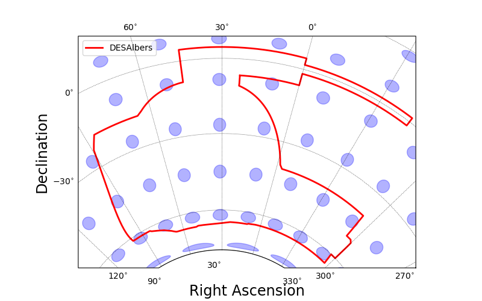
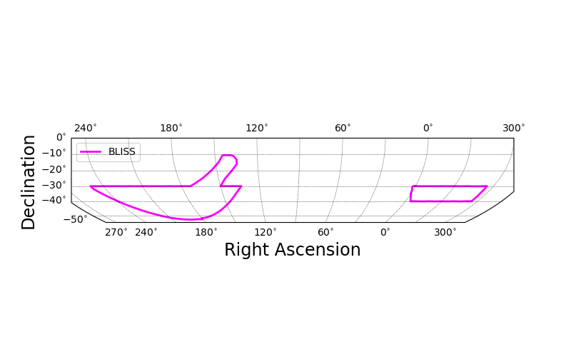
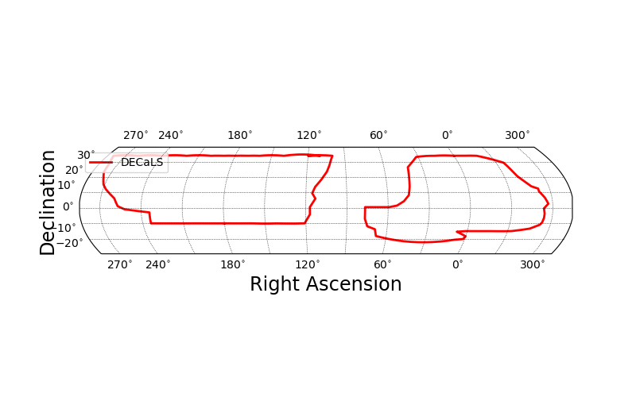

.. _surveys:
.. role:: python(code)
   :language: python

SkyProj Surveys
===============

`SkyProj` has pre-defined a number of survey classes.
These classes have been set with a preferred projection type and axis ranges, as well as defining methods to draw the survey outline.
Note that when using these survey classes to create a projection, then when you plot a map the default is not to zoom in on the range of the map, but to keep the survey range.

DESSkyproj
----------

The :code:`skyproj.DESSkyproj()` projection sets the projection for plotting the survey outline of the `Dark Energy Survey <https://www.darkenergysurvey.org/>`_ (DES).
The default for DES uses the :code:`skyproj.McBrydeSkyproj()` centered at +30 degrees longitude.
The outline of DES can be accessed with :code:`draw_des()`.

.. code-block :: python

    import matplotlib.pyplot as plt
    import skyproj

    fig, ax = plt.subplots(figsize=(8, 5))
    sp = skyproj.DESSkyproj(ax=ax)
    sp.draw_des(label='DES')
    sp.tissot_indicatrices(radius=2.5, num_lon=18, num_lat=10, color='blue', alpha=0.3)
    sp.ax.legend()
    plt.show()

.. image:: images/DES_survey_with_indicatrices.png
   :width: 600
   :alt: DES Survey projection and survey outline with Tissot indicatrices.

DESAlbersSkyproj
----------------

The :code:`skyproj.DESAlbersSkyproj()` projection sets the projection for plotting the survey outline of the DES using an Albers Equal Area projection.
The default for DES (Albers) uses the :code:`skyproj.AlbersSkyproj()` centered at +30 degrees longitude, with standard parallels at -15 degrees and -50 degrees latitude.

The outline of DES can be accessed with :code:`draw_des()`.

.. code-block :: python

    import matplotlib.pyplot as plt
    import skyproj

    fig, ax = plt.subplots(figsize=(8, 5))
    sp = skyproj.DESAlbersSkyproj(ax=ax)
    sp.draw_des(label='DESAlbers')
    sp.tissot_indicatrices(radius=2.5, num_lon=18, num_lat=10, color='blue', alpha=0.3)
    sp.ax.legend()
    plt.show()

BlissSkyproj
------------

The :code:`skyproj.BlissSkyproj()` projection sets the projection for plotting the survey outline of the Blanco Imaging of the Southern Sky (BLISS) survey.
The default for BLISS uses the :code:`skyproj.McBrydeSkyproj()` centered at 100 degrees longitude.
The outline of BLISS can be accessed with :code:`draw_bliss()`.

.. code-block :: python

    import matplotlib.pyplot as plt
    import skyproj

    fig, ax = plt.subplots(figsize=(8, 5))
    sp = skyproj.BlissSkyproj(ax=ax)
    sp.draw_bliss(label='BLISS')
    sp.ax.legend()
    plt.show()

MaglitesSkyproj
---------------

The :code:`skyproj.MaglitesSkyproj()` projection sets the projection for plotting the survey outline of the Magellanic Satellites Survey (MagLiteS).
The default for MagLiteS uses the :code:`skyproj.LaeaSkyproj()` centered at the South Pole.
The outline of MagLiteS can be accessed with :code:`draw_maglites()`.

.. code-block :: python

    import matplotlib.pyplot as plt
    import skyproj

    fig, ax = plt.subplots(figsize=(8, 5))
    sp = skyproj.MaglitesSkyproj(ax=ax)
    sp.draw_maglites(label='MagLiteS')
    sp.ax.legend()
    plt.show()

DecalsSkyproj
-------------

The :code:`skyproj.DecalsSkyproj()` projection sets the projection for plotting the survey outline of the `Dark Energy Camera Legacy Survey <https://www.legacysurvey.org/decamls/>`_ (DECaLS).
The default for DECaLS uses the :code:`skyproj.McBrydeSkyproj()` centered at 105 degrees longitude.
The outline of DECaLS can be accessed with :code:`draw_decals()`.

.. code-block :: python

    import matplotlib.pyplot as plt
    import skyproj

    fig, ax = plt.subplots(figsize=(8, 5))
    sp = skyproj.DecalsSkyproj(ax=ax)
    sp.draw_decals(label='DECaLS')
    sp.ax.legend()
    plt.show()

RomanHLWASSkyproj
-----------------

The :code:`skyproj.RomanHLWASSkyproj()` projection sets the projection for plotting the survey outline of the `Roman Space Telescope 
High Latitude Wide Area Survey (HLWAS) <https://roman-docs.stsci.edu/roman-community-defined-surveys/high-latitude-wide-area-survey>`_.
The default for the Roman HLWAS uses the :code:`skyproj.McBrydeSkyproj()` centered at -90 degrees longitude.
The outline of the Roman HLWAS can be accessed with :code:`draw_roman_hlwas()`.

.. code-block :: python

    import matplotlib.pyplot as plt
    import skyproj

    fig, ax = plt.subplots(figsize=(8, 5))
    sp = skyproj.RomanHLWASSkyproj(ax=ax)
    sp.draw_roman_hlwas(label='Roman HLWAS')
    sp.legend()
    plt.show()

.. image:: ../docs/images/Roman_HLWAS_survey.png
   :width: 600
   :alt: Roman HLWAS projection and survey outline.
